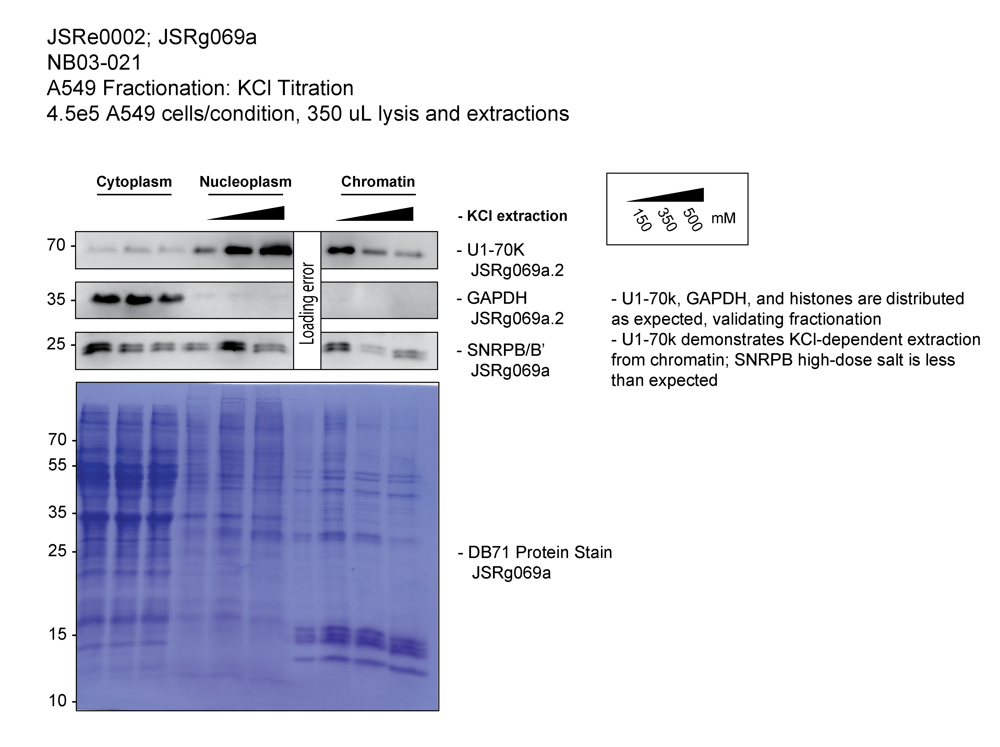

```{r setup, include=FALSE}
knitr::opts_chunk$set(echo = TRUE)
```

```{r Packages, echo=FALSE, include = FALSE}
# Load necessary libraries
library(shiny)
library(tinytex)
library(rmarkdown)
library(tidyverse)
library(lubridate)
library(readxl)
library(dplyr)
library(lubridate)
# install.packages("scales")
library(scales)
library(forcats)
library(stringr)                   # Load stringr
library(stringi)

date_2 <- ymd(today())
date <- format(ymd(today()), "%Y%m%d")

```

```{r Load To Do from Inventory, echo= FALSE, warning = FALSE}
#fig.width=12, fig.height=10
# setwd("/Users/jacobroth/Library/CloudStorage/OneDrive-Personal/RothJacob_PhDFiles/4-LabWorkFiles")
todo <- readxl::read_excel("InventorySheet_jsr.xlsx",
                           sheet = "NB-Index",
                           skip = 0)

todo$JSR_ExpName <- paste(todo$Exp,"_",todo$ExpName, sep = "")

todo <- todo %>% mutate(chunk = ifelse(TalkAboutInMeeting == "active", TRUE, FALSE))

```


```{r table of unique active projects, echo=FALSE}

# Make summary table of all projects
projects <- todo %>%
  dplyr::select(Status,TalkAboutInMeeting,Exp,JSR_ExpName,chunk) %>%
  dplyr::filter(grepl('JSRe', Exp)) %>%
  # dplyr::filter(grepl('TRUE', chunk)) %>%
  unique() %>%
  arrange(Exp)

# projects$chunk[projects$Exp == "JSRe0043"]


todo_small <- todo %>%
    dplyr::filter(grepl('active', Status)) %>%
  # dplyr::filter(Status2 == "active") %>%
  dplyr::select(Exp,Experiment
                # ,Priority
                ) %>%
  dplyr::filter(grepl("JSR",Exp)) %>%
  # arrange(Priority) %>%
  arrange(Exp) %>%
  unique()


```


## List of all projects that are "active" but and this week's priority

```{r Active project table ordered by importance, echo = FALSE}
todo_active <- todo %>%
    dplyr::filter(grepl('active', TalkAboutInMeeting)) %>%
  # dplyr::filter(Status2 == "active") %>%
  dplyr::select(Exp,Experiment
                # ,Priority
                ) %>%
  dplyr::filter(grepl("JSR",Exp)) %>%
  # arrange(Priority) %>%
  # arrange(Exp) %>%
  unique()

#kable tables
##https://cran.r-project.org/web/packages/kableExtra/vignettes/awesome_table_in_html.html
knitr::kable(todo_active, 
             caption = "Active Projects")


```

# Things to discuss today
1. asdf
2. asdf

# Overarching Questions
- Following PRMTi, what happens in the cell at early timepoints to alter transcription?

# Experiments

```{r JSRe0001, echo=FALSE, results='asis', eval=projects$chunk[projects$Exp == "JSRe0001"], warning=FALSE}
cat(
"
## JSRe0001-T_IF_NB02-125_test
### Objective
-	na

### Background
-	na

### Status
-	na

### Next
-	na


")
```

```{r JSRe0002, echo=FALSE, results='asis', eval=projects$chunk[projects$Exp == "JSRe0002"], warning=FALSE}
cat(
"
## JSRe0002-T_Cellular-WB_NB02-153_Chromatin analysis of PRMTi cells: titration of KCl for fractionation validation
### Objective
-	To validate a fractionation protocol for completing sub-cellular fractionation of cells; define sensitivity to salt (KCl) in nucleoplasm buffer 
- Utilize protocol: P_Cellular_Fractionation_20220119_jsr.docx

### Status
-	Completed trial protocol with test samples

### Results
Update this code with the path to your actual files:

''

### Discussion
- U1-70k, GAPDH, and histones are distributed as expected, validating fractionation
- U1-70k demonstrates KCl-dependent extraction from chromatin; SNRPB high-dose salt is less than expected

### Next
-	Validated protocol and ready for next exp
- Apply this protocol to PRMT5i-samples to test for altered sub-cellular localization

")
```
```{r JSRe0003, echo=FALSE, results='asis', eval=projects$chunk[projects$Exp == "JSRe0003"], warning=FALSE}
cat(
"
## JSRe0003
### Objective
-	na

### Background
-	na

### Status
-	na

### Next
-	na


")
```

```{r Projects by importance, echo = FALSE}

#kable tables
##https://cran.r-project.org/web/packages/kableExtra/vignettes/awesome_table_in_html.html
knitr::kable(todo_small, 
             caption = "All active projects")


```


# Random Ideas:
- Revisit identification of Rme sites that are involved in ClinVar mutations


# Papers to Read
- Genome-wide screen of cell-cycle regulators in normal and tumor cells identifies a differential response to nucleosome depletion
